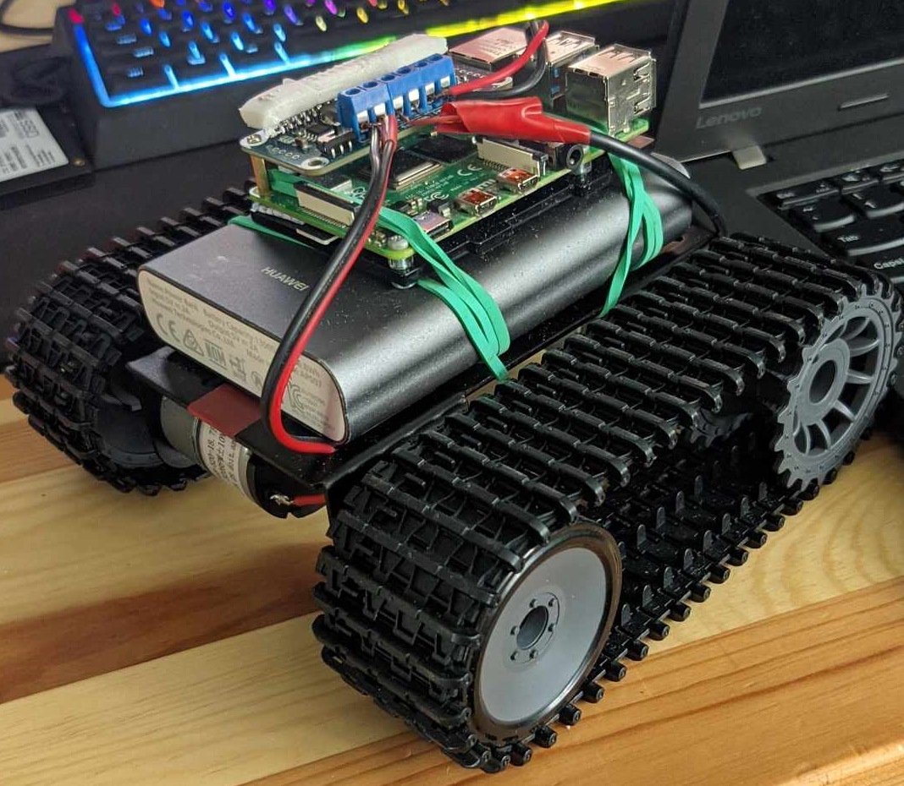
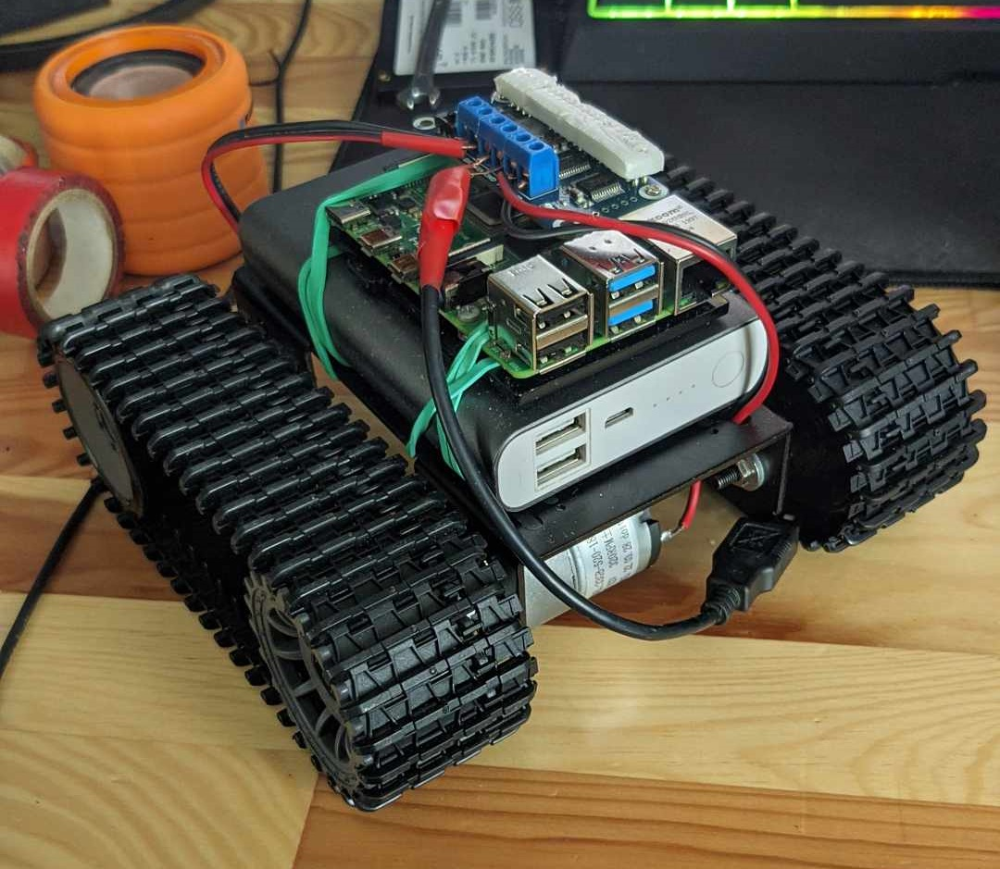
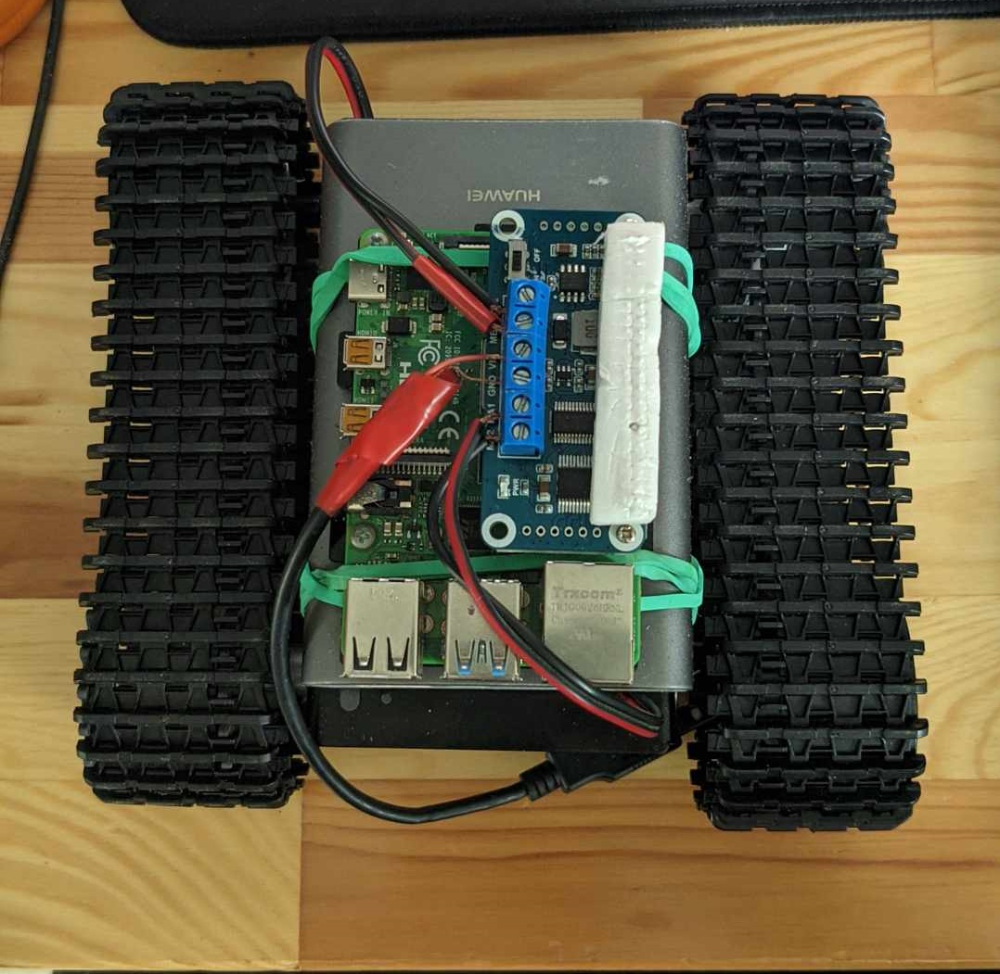
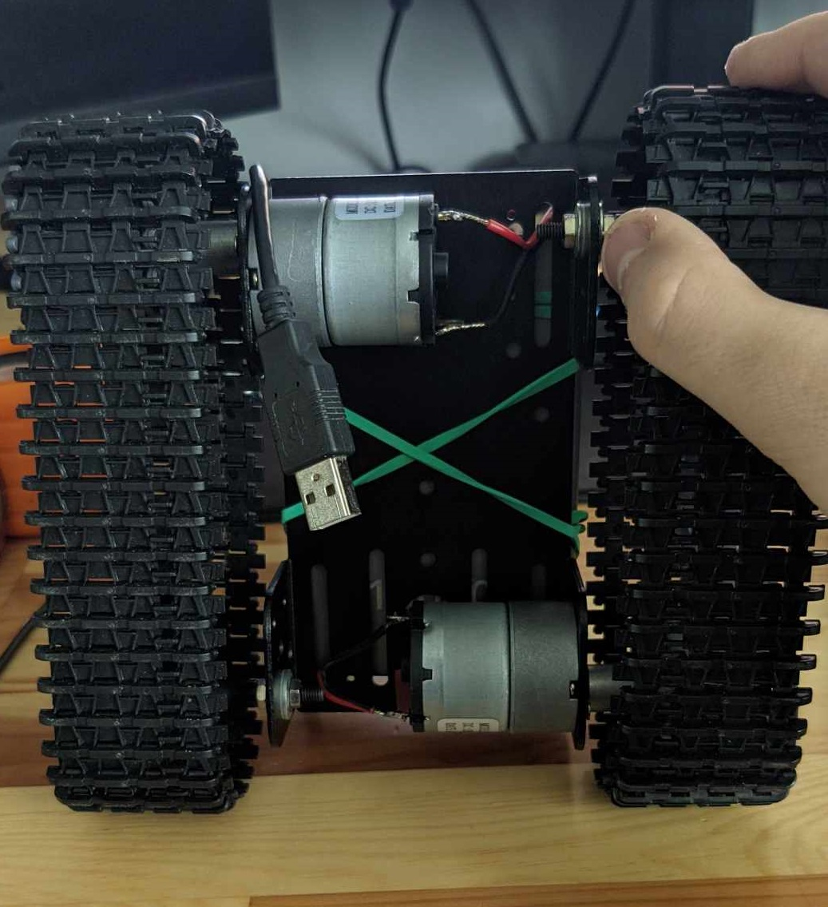
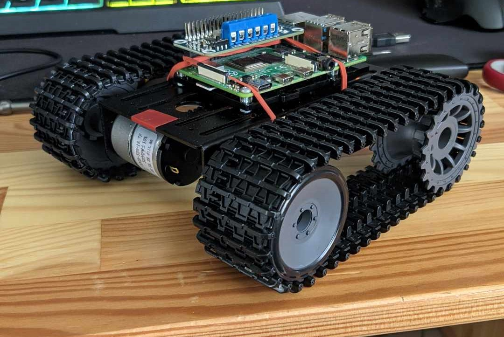
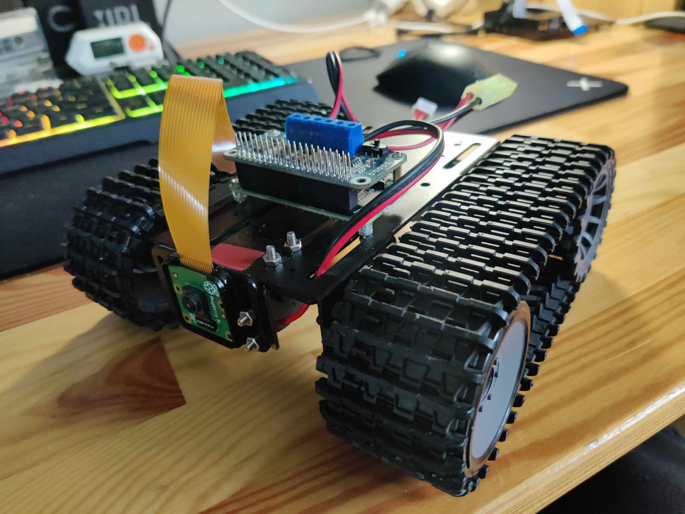
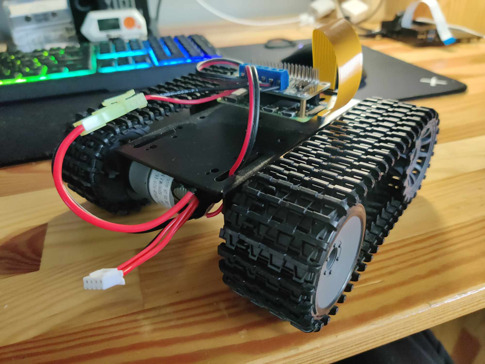
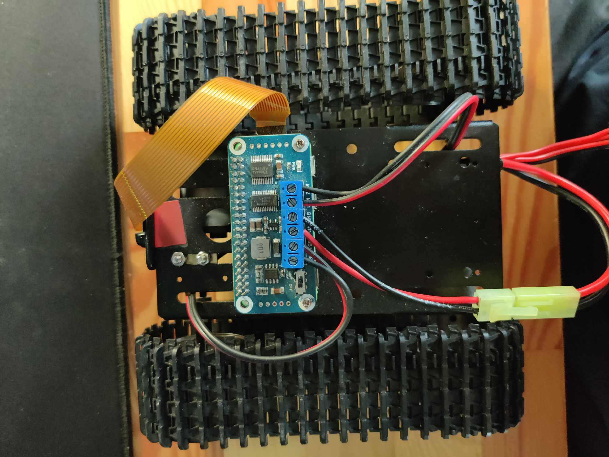
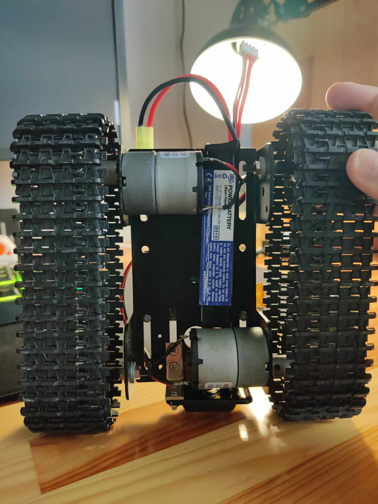

# Ladzik - remote controlled robot using web browser

robot named "Ladzik" is really just a raspberry pi on crawler platform. It has an attached a raspberry pi camera v2 on front and a lipo battery mounted underneath a platform for vision and power. For a computer that drives everything I opted for raspberry pi zero W but you can use for example:
 
<ul>
<li>rasberry pi 4 - it is set in parallel with platform and in my case I used rubberbands to secure it</li>
<li>arduino - not tested but manufacturer of the platform shows arduino uno is supported and has a holes for it</li>
<li>any other microcontroller - I couldn't test it, I don't have any</li>
</ul>

<h2>for creating your own Ladzik you will need:</h2>
<ul>
    <li>raspberry pi zero 2 W - main computer</li>
    <li>DFRobot Black Gladiator ROB0153 - crawler platform</li>
    <li>dual channel DC motor driver HAT - I used Waveshare 15364 but of course you can use other</li>
    <li>raspberry pi camera V2 - or any other you like/have</li>
    <li>case for camera - I used Adafruit 3253 but WARNING! Do not use it with original raspberry pi camera v2 it dosen't fit and because of that focus is destroyed</li>
    <li>in some cases you will need an adapter for raspberry pi zero camera output, it is smaller than ribbon cable that pi camera comes with.</li>
</ul>

Additionally, you will need bare wires to connect the dc motors from the pi's HAT and a male connector to the lipo battery, in my case it was a small tamiya, but now lipo batteries come with a T-connect or even a large tamiya. Of course, you can use 18650, AA or even a powerbank, but remember that powerbanks have overload protection and if you draw too much current, the powerbank will cut off the power.

Some rambling about powering a Ladzik using powerbank. When doing that use USB breakout board or even bare usb plug for soldering, check what pins are 5V and ground and solder wires accordingly. That is easiest way of getting power from powerbank to pi's HAT. After that I recommend using 5V to 12V step up converter because that what is needed in pi's motor driver HAT. That will not bypass powerbank's internal overload protection but will supply 12V with 0.5A max. For more ampers you will need to enable quick charge over usb if your powerbank support's it. In short, I do not recommend powerbanks for this project at all. 

<h3>Here are some photos when the robot had a powerbank as power supply, raspberry pi 4 as main computer and without camera:</h3>

front

back

top

underneath

without powerbank

<h3>and here are some photos of the current state:</h3>

front

back

top

underneath

Of course, this project is in infinite development and will change over time, but as of today I can provide lists of changes and fixes that will appear in the future:

<h2>changes:</h2>
<ul>
<h3>web controller</h3>
<li>Add functionality to buttons, switches and sliders in LIVEFEED_CONTROLS section</li>
<li>Add functionality to Basic Web Downloader (DOWNLOAD CONTENT button on the bottom)</li>
<li>Add filters to the camera, which can be enabled through a new section</li>
<li>Add toggle in LIVEFEED_CONTROLS that adds time and date on camera livefeed</li>
<li>Add settings next to DOWNLOAD CONTENT button (for example: filters and text on captured photos and videos?)</li>
<li>Add the ability to control Ladzik using a xbox/ps controller hooked up via bluetooth (bluetooth on/off in settings)</li>
<h3>Ladzik</h3>
<li>Make and attach 3d printed case (maybe Fiat 126p)</li>
<li>MAYBE change motor driver board to something with better cable connectors or solder a new one</li>
<li>Add lights on the front (LED strip on case or hat connector)</li>
<li>Add a proximity sensor</li>
<li>change the lipo battery to 2x 18650 and add a BMS to see how much power is left</li>

</ul>

<h2>fixes:</h2>
<ul>
<h3>web controller</h3>
<li>Fix flickering on livefeed (PAL and NTSC switch maybe)</li>
<li>Fix joystick error when used first time after boot (wrong values)</li>
<li>fix livefeed error when browser is refreshed/new connection is made</li>
<li>improve responisibility of a controller</li>
<li>much more will be added during testing</li>
<h3>Ladzik</h3>
<li>nothing</li>
</ul>

<h2>PCA9685.py and main.py are based on/copied from code published on https://www.waveshare.com/wiki/Motor_Driver_HAT in section "Demo".</h2>

That code is for controlling HAT attachment on raspberry pi zero 2 w that drives motors of a robot.

